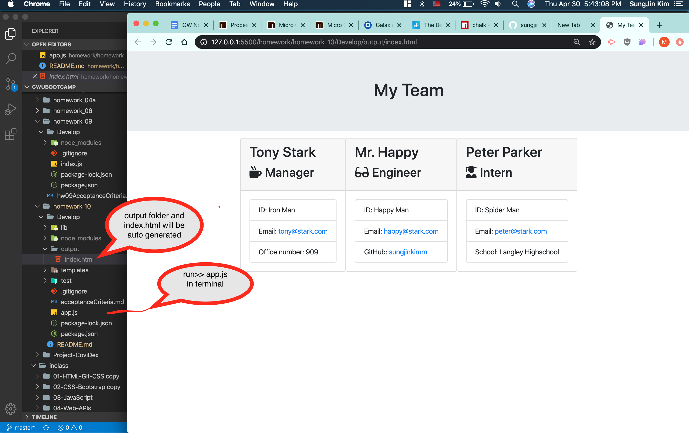

# Team Profile Generator

## Link
[https://github.com/kbarcaa](https://github.com/kbarcaa)

## Project Description:

This assignment was created with the components introduced in Object Oriented Programming (OOP).

Combined various NPMs such as inquirer, fs, chalk and the use of Classes and Constructor functions.

## Table of Contents:

* [Installation](#Installation)
* [Usage](#Usage)
* [Credits](#Credits)
* [License](#License)

## Installation:

* [Git-clone](git@github.com:kbarcaa/homework_10.git)
* L git@github.com:kbarcaa/homework_10.git
* install npm packages
* in terminal of the root directory >> run >> node app.js 
* Output folder will be auto generated.

## Usage: 

Managers will be able to use this tool for team organization.
* able to add in new team members according to job title
* able to view team members on a webpage

## Credits: 

## License: 

MIT License Copyright(c) 2020 sjk

Permission is hereby granted, free of charge, to any person obtaining a copy of this software and associated documentation files (the "Software" ), to deal in the Software without restriction, including without limitation the rights to use, copy, modify, merge, publish, distribute, sublicense, and/or sell copies of the Software, and to permit persons to whom the Software is furnished to do so, subject to the following conditions:

The above copyright notice and this permission notice shall be included in all copies or substantial portions of the Software.

THE SOFTWARE IS PROVIDED "AS IS",  WITHOUT WARRANTY OF ANY KIND, EXPRESS OR IMPLIED, INCLUDING BUT NOT LIMITED TO THE WARRANTIES OF MERCHANTABILITY FITNESS FOR A PARTICULAR PURPOSE AND NONINFRINGEMENT. IN NO EVENT SHALL THE AUTHORS OR COPYRIGHT HOLDERS BE LIABLE FOR ANY CLAIM, DAMAGES OR OTHER LIABILITY, WHETHER IN AN ACTION OF CONTRACT, TORT OR OTHERWISE, ARISING FROM, OUT OF OR IN CONNECTION WITH THE SOFTWARE OR THE USE OR OTHER DEALINGS IN THE SOFTWARE.

## Badge: 

## GitHub URL & Profile
[GitHub URL](https://github.com/kbarcaa)

<!--  -->

